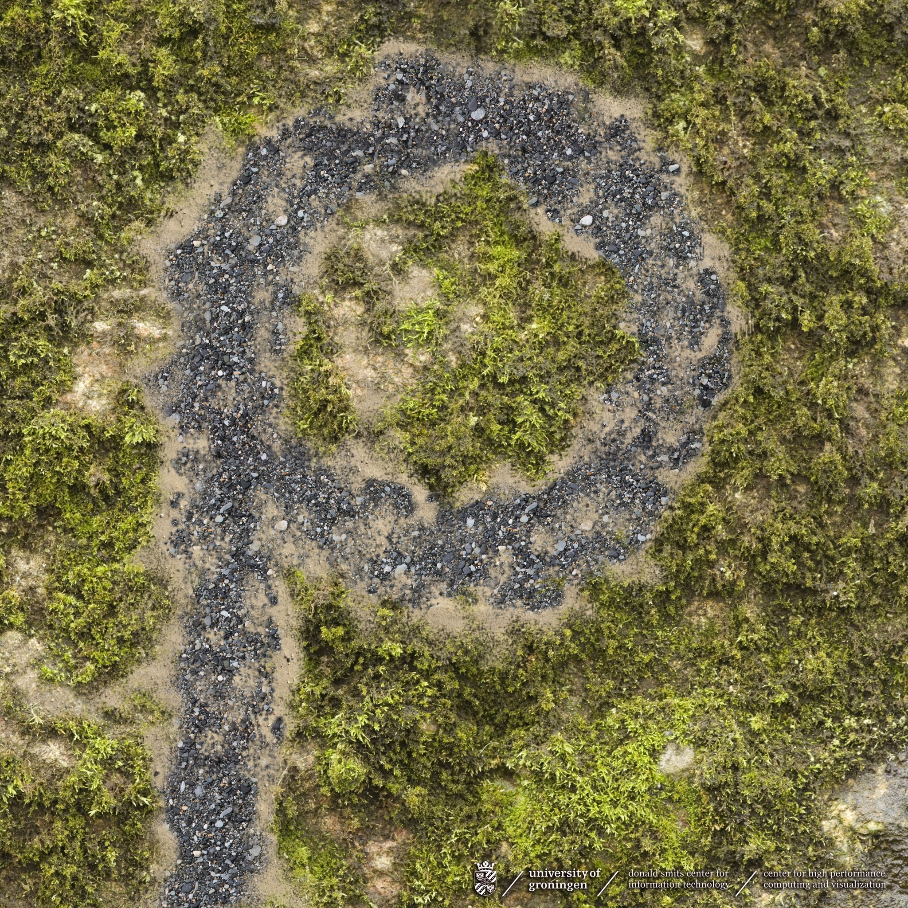

                   Tiled Directional Flow
Move source code with images from [here](https://www.rug.nl/cit/hpcv/publications/watershader/hpcv-water-29-oct-2010.zip) to github.
And some introduction can be found on this [web](http://www.rug.nl/society-business/centre-for-information-technology/research/hpcv/publications/watershader/).
Final result of watershader was like this picture bellow.

 (c) 2010 frans van hoesel, university of groningen

advantages of this shader:
- flow in any direction
- waves can rotate with the flow direction
- waves can be scaled (in this demo the waves are smaller on the inside)
- no visible tiling (even for very large surfaces like open sea)
- no pulsing effect

 this shader creates animated water by transforming normalmaps
 the scaling and rotation of the normalmaps is done per tile
 and is constant per tile. Each tile can have its own parameters
 for rotation, scaling, and speed of translation
 To hide the seams between the tiles, all seams have another tile
 centered over the seam. The opacity of the tiles decreasen towards the
 edge of the tiles, so the edge isn't vissible at all.
 Basically, all points have four tiles (A,B,C and D), mixed together
 (allthough at the edges the contribution of a tile to this mix is 
 reduced to zero).
 The mixing of the tiles each with different parameters gives a nice
 animated look to the water. It is no longer just sliding in one direction, but
 appears to move more like real water. 

 The resulting sum of normalmaps, is used to calculate the refraction of the clouds 
 in a cube map and can also be used for other nice effects. In this example the 
 colormap of the material under water is distorted to fake some kind of refraction
 (for this example the water is a bit too transparent, but it shows this refraction
 better) 

 A flowmap determines in the red and green channel the normalized direction of the
 flow and in the blue channel wavelength.
 The alpha channel is used for the transparency of the water. Near the edge, the 
 water becomes less deep and more transparent. Also near the edge, the waves tend
 to be smaller, so the same alpha channel also scales the height of the waves.
 Currently the wavelength is in its own channel (blue), but could be premultiplied
 to the red and green channels. This makes this channel available for changing the 
 speed of the waves per tile.

//////////////////////////////////////////////////////////////////////////////////
//                     This software is Creditware:
//
// you can do whatever you want with this shader except claiming rights 
// you may sell it, but you cannot prevent others from selling it, giving it away 
// or use it as they please.
// 
// Having said that, it would be nice if you gave me some credit for it, when you
// use it.
//
//                     Frans van Hoesel, (c) 2010
//////////////////////////////////////////////////////////////////////////////////
 
movie at youtube: http://www.youtube.com/watch?v=TeSuNYvXAiA

 Thanks to Bart Campman, Pjotr Svetachov and Martijn Kragtwijk for their help.

The OSG file is an example (the same as shown in the movie mentioned above)
You can watch it by using the osgviewer.
Osgviewer is included as an example in the downloads of osg.
Osg can be found at http://www.openscenegraph.org/projects/osg.
With the osgviewer you can pan, zoom, rotate the scene and see the effect of the shader
in real-time

more specifically, download and install:
http://www.openscenegraph.org/downloads/stable_releases/OpenSceneGraph-2.8.3/binaries/Windows/VisualStudio8/openscenegraph-all-2.8.3-win32-x86-vc80sp1-Release.zip
and if you don't have it one of:
http://www.openscenegraph.org/projects/osg/wiki/Downloads/VisualStudioBinaries
(for visual studio 8)

